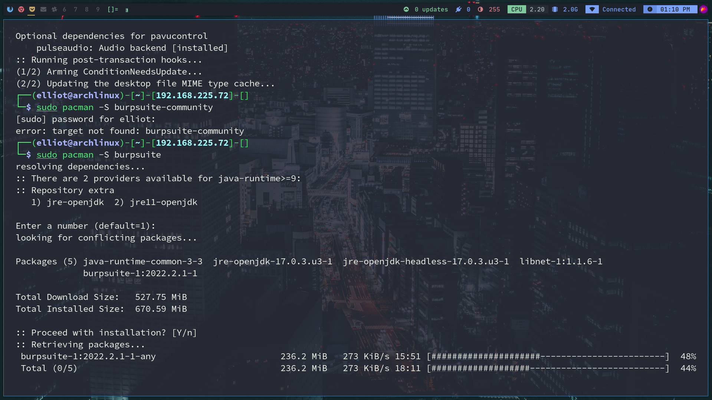
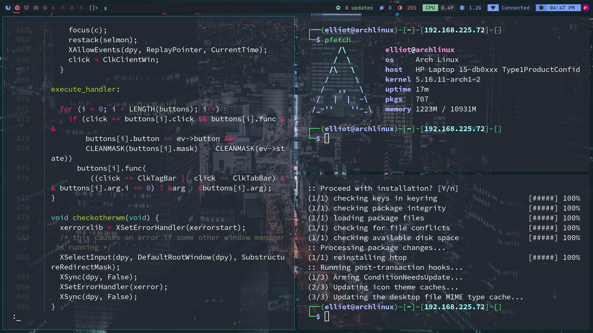
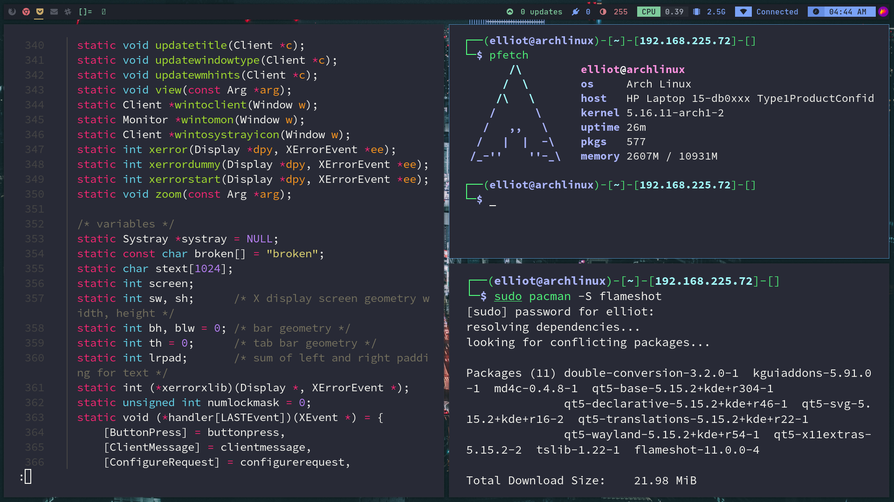

# DWM

> DWM Dotfiles for Arch Linux on main system build.
> refractored by Gaurav Raj [TheHackersBrain]

---

## Screenshots





## Directory Tree

```bash
.
├── config
│   ├── alacritty
│   │   └── alacritty.yml
│   ├── dunst
│   │   ├── dunstrc
│   │   └── dunstrc.bak
│   ├── dwm
│   │   ├── config.def.h
│   │   ├── config.def.h.bak
│   │   ├── config.h
│   │   ├── config.mk
│   │   ├── drw.c
│   │   ├── drw.h
│   │   ├── drw.o
│   │   ├── dwm
│   │   ├── dwm.1
│   │   ├── dwm.c
│   │   ├── dwm.o
│   │   ├── dwm.png
│   │   ├── fibonacci.c
│   │   ├── functions.h
│   │   ├── gaplessgrid.c
│   │   ├── Makefile
│   │   ├── movestack.c
│   │   ├── scripts
│   │   │   ├── autostart
│   │   │   ├── bar.sh
│   │   │   ├── bar_themes
│   │   │   │   ├── catppuccin
│   │   │   │   ├── everblush
│   │   │   │   ├── gruvchad
│   │   │   │   ├── nord
│   │   │   │   └── onedark
│   │   │   └── fetch
│   │   ├── themes
│   │   │   ├── catppuccin.h
│   │   │   ├── everblush.h
│   │   │   ├── gruvchad.h
│   │   │   ├── nord.h
│   │   │   └── onedark.h
│   │   ├── transient.c
│   │   ├── util.c
│   │   ├── util.h
│   │   ├── util.o
│   │   └── vanitygaps.c
│   ├── picom
│   │   └── picom.conf
│   └── terminator
│       └── config
├── etc
│   └── X11
│       └── xorg.conf.d
│           └── 20-amdgpu.conf
├── local
│   └── share
│       └── fonts
│           ├── materialdesignicons-webfont.ttf
│           ├── materialdesignicons-webfont.woff
│           ├── materialdesignicons-webfont.woff2
│           ├── MaterialIcons-Regular.ttf
│           └── Material.ttf
├── README.md
├── robbyrussell.zsh-theme
├── screenshots
│   ├── desk1.png
│   ├── desk2.png
│   └── desktop.png
├── wallpaper
│   ├── city.jpg
│   ├── wallpaper.jpg
│   └── wolf.jpg
├── xprofile
└── zshrc

18 directories, 55 files

```
